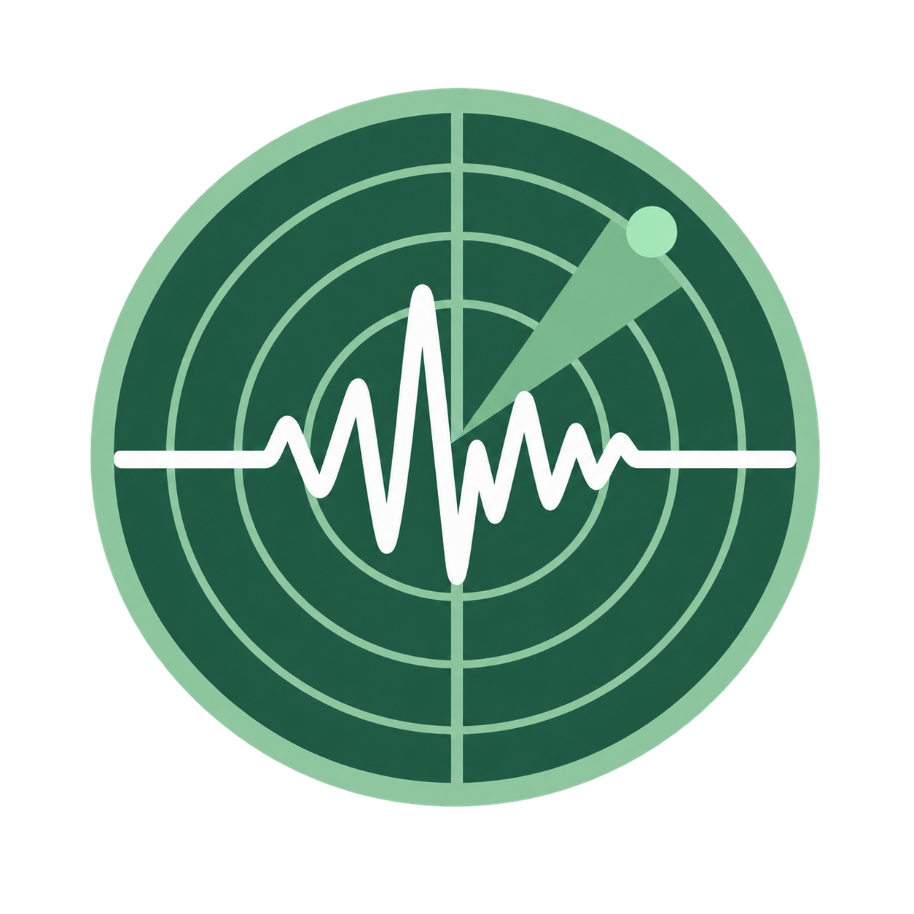

<div align="center">
  
  <h1>Sismi</h1>
  <p><strong>Información sísmica clara para estar preparado</strong></p>
  <p>
    <a href="https://github.com/Alejooc/sismi/releases/latest">Descargar para Windows</a>
    ·
    <a href="https://github.com/Alejooc/sismi/blob/main/CHANGELOG.md">Versiones</a>
    ·
    <a href="https://github.com/Alejooc/sismi/issues">Reportar un problema</a>
  </p>
</div>

Sismi es una aplicación de escritorio pequeña y discreta para consultar actividad sísmica reciente, revisar el historial y recibir avisos cuando aparece un evento que coincide con tu configuración. También puede actualizarse desde la propia app.

## Qué puedes hacer

- Ver los eventos más recientes en un panel flotante junto a la bandeja de Windows.
- Consultar el historial sísmico y buscar por lugar, fuente o identificador.
- Explorar un globo terráqueo interactivo con países, ciudades, magnitudes y ondas suaves.
- Elegir alertas para **Mi zona** o **Todo el mundo**.
- Configurar una ubicación buscando una ciudad o usando la ubicación del dispositivo.
- Recibir una alerta visual, sonora y una notificación nativa de Windows.
- Usar modo claro u oscuro.

## Descargar en Windows

La descarga recomendada es el instalador oficial de Windows. Después de instalar Sismi, las nuevas versiones podrán descargarse desde **Acerca de Sismi → Actualizaciones**, sin reemplazar archivos manualmente.

1. Abre la página de [Releases](https://github.com/Alejooc/sismi/releases/latest).
2. Descarga el instalador `Sismi_<versión>_x64-setup.exe` desde la sección **Assets**.
3. Ejecuta el instalador y sigue los pasos de Windows.
4. Sismi quedará disponible en la bandeja del sistema. Haz clic izquierdo en el icono para mostrarlo y clic derecho para ver más opciones.

También se conserva una descarga portable cuando la publicación la incluye, pero esa modalidad no permite el mismo flujo de actualización automática que el instalador.

La guía completa está en [Descargar y usar Sismi en Windows](docs/DESCARGAR-WINDOWS.md).

## Ejecutar el proyecto desde el código fuente

### Requisitos

- Windows 10 u 11 con WebView2.
- Node.js 20 o superior.
- Rust y las herramientas de compilación de Visual Studio para compilar la aplicación de escritorio.

### Desarrollo web

```powershell
npm install
npm run dev
```

### Desarrollo de escritorio

```powershell
npm install
npm run desktop:dev
```

### Compilar el instalador de Windows

```powershell
npm run desktop:build
```

El instalador se genera en `src-tauri/target/release/bundle/nsis/`. Para crear artefactos de actualización localmente se necesita la clave privada de firma en las variables `TAURI_SIGNING_PRIVATE_KEY` y `TAURI_SIGNING_PRIVATE_KEY_PASSWORD`. El flujo recomendado para publicar es GitHub Actions.

Consulta [Actualizaciones automáticas](docs/ACTUALIZACIONES.md) para configurar la publicación firmada.

## Fuentes de información

Sismi consulta y combina datos públicos de:

- [Servicio Geológico Colombiano](https://www.sgc.gov.co/)
- [USGS Earthquake Hazards Program](https://earthquake.usgs.gov/)
- [Open-Meteo Geocoding](https://open-meteo.com/en/docs/geocoding-api) para buscar ciudades y ubicaciones

Las fuentes pueden publicar un mismo evento con tiempos, magnitudes o identificadores distintos. Sismi intenta combinar registros equivalentes y evita repetir alertas antiguas.

## Privacidad y uso responsable

- La ubicación automática solo se solicita cuando eliges **Ubicación actual**.
- La ubicación seleccionada se guarda localmente para conservar tu configuración.
- Los datos sísmicos se consultan directamente desde las fuentes públicas configuradas.
- Sismi es una herramienta informativa y no reemplaza las instrucciones de las autoridades.

## Estado del proyecto

La versión pública actual es `v0.1.18`. Consulta el [historial de cambios](CHANGELOG.md) para ver lo incluido en cada versión y la [guía de Windows](docs/DESCARGAR-WINDOWS.md) para obtener ayuda.

## Licencia

Este proyecto se distribuye bajo la licencia [MIT](LICENSE).
